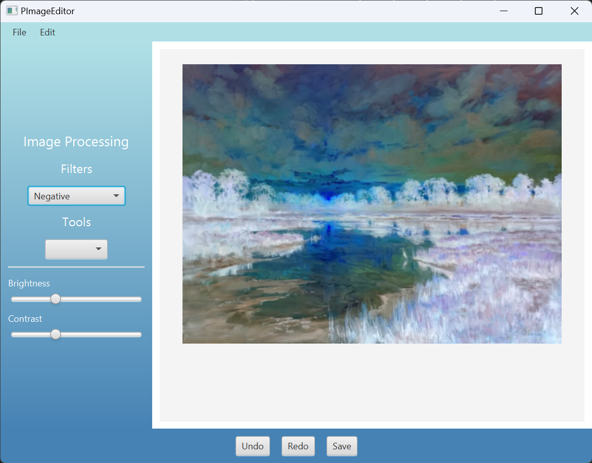

# [PImageEditor]

## [Mô tả dự án]
Dự án này là một ứng dụng xử lý ảnh được phát triển bằng ngôn ngữ Java, hỗ trợ nhiều bộ lọc và công cụ chỉnh sửa ảnh. Ứng dụng cho phép người dùng tải lên hình ảnh, áp dụng các hiệu ứng, điều chỉnh thông số, và lưu kết quả một cách dễ dàng.

## [Mục tiêu dự án]
- Xây dựng một ứng dụng xử lý ảnh nhanh, dễ sử dụng.
- Cung cấp các công cụ chỉnh sửa cơ bản và nâng cao.
- Giao diện thân thiện, hỗ trợ tương tác trực quan với ảnh.

## [Công nghệ sử dụng]
- Ngôn ngữ lập trình: Java
- Giao diện: JavaFX, SceneBuilder
- Xử lý ảnh: BufferedImage, Graphics2D
- Lưu trữ dữ liệu: MySQL
- Lưu file: Java FileChooser

## [Cấu trúc dự án]
```java
├──  src
│   ├──  main
│   │   ├──  java
│   │   │   ├──  module-info.java
│   │   │   ├──  org
│   │   │   │   ├──  example
│   │   │   │   │   ├──  app
│   │   │   │   │   │   ├──  DataBaseConnection.java
│   │   │   │   │   │   ├──  ImageHistory.java
│   │   │   │   │   │   ├──  ImageOperation.java
│   │   │   │   │   │   ├──  ImageProcessor.java
│   │   │   │   │   │   ├──  LoginController.java
│   │   │   │   │   │   ├──  Main.java
│   │   │   │   │   │   ├──  SceneController.java
│   │   │   │   │   │   ├──  ToolsController.java
│   │   ├──  resources
│   │   │   ├──  Image
│   │   │   │   ├──  Facebook-logo-removebg-preview.png
│   │   │   │   ├──  Login-Image.jpg
│   │   │   │   ├──  X-logo-removebg-preview.png
│   │   │   │   ├──  google-logo-removebg-preview.png
│   │   │   ├──  org
│   │   │   │   ├──  example
│   │   │   │   │   ├──  app
│   │   │   │   │   │   ├──  app-UI.fxml
│   │   │   │   │   │   ├──  hello-view.fxml

```

## [Tính năng chính]
### Màn hình đăng nhập
](image.png)

### Bộ lọc ảnh
- Ta có ảnh gốc:


- Bộ lọc đen trắng (Grayscale):


- Làm mờ (Blur):


- Bộ lọc âm bản (Negative):


- Bộ lọc nổi khối (Emboss):
 

... và nhiều bộ lọc khác

### [Chỉnh sửa ảnh]
- Xoay ảnh:


- Lật ảnh:


- Điều chỉnh độ sáng bằng thanh điều chỉnh:


... và nhiều thao tác khác 

### [Quản lý ảnh]
- Mở ảnh từ máy tính:


- Lưu ảnh:


- Thao tác Undo/Redo:


### [Liên hệ]
- Tác giả: Trần Lê Nam Khánh
- Email: tranlenamkhanh2k5@gmail.com
@PImageEditor